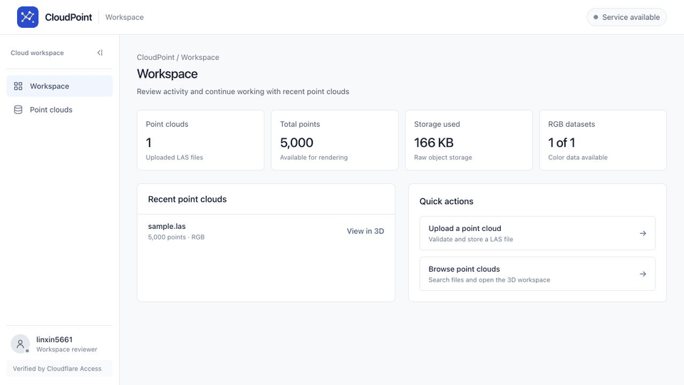
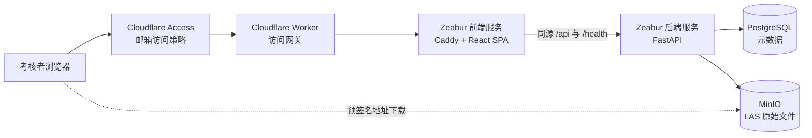

# CloudPoint — 简易点云上传平台

CloudPoint 是一个基于浏览器的 LAS 点云管理平台，支持文件校验与存储、PostgreSQL 元数据管理，以及基于 Three.js WebGL 的在线点云查看。查看器支持 RGB 与高程着色，并提供旋转、缩放和平移等操作。

完整流程：**上传点云 → 校验文件 → 存入 MinIO → 记录 PostgreSQL 元数据 → 前端资源库 → 浏览器在线查看**。

---

## 在线演示

**[打开受保护的 CloudPoint 工作台](https://cloudpoint-access-gateway.linxin5661.workers.dev/)**

生产环境由 Cloudflare Access 保护。访问者需要使用已加入访问策略的邮箱，通过邮箱验证码登录。



### 生产架构



## 1. 技术栈与选型

| 层级 | 技术选型 | 选型原因 |
|------|----------|----------|
| 前端 | React + Vite + Tailwind CSS | 开发与构建速度快，适合构建结构清晰的工作台界面 |
| 三维查看器 | Three.js | 可在浏览器中直接渲染 LAS 数据，支持 RGB、旋转、缩放和平移 |
| 后端 | FastAPI | 类型明确、异步支持良好，并自动生成 OpenAPI 文档 |
| 数据库 | PostgreSQL + SQLAlchemy 2 | 用于可靠地保存点云元数据 |
| 对象存储 | MinIO（兼容 S3） | 将大型二进制文件与关系数据库分离 |
| LAS 解析 | 自定义头部解析器 + laspy | 校验成本低、便于测试，也方便后续扩展 |

项目采用单体仓库结构，后端位于 `backend/`，前端位于 `frontend/`。对于当前规模，一个仓库可以统一维护版本、文档和 API 契约，交付和审阅也更直观。

### 为什么选择 Three.js

Potree 支持流式层级细节加载，但需要先使用 `PotreeConverter` 将 LAS 转换为八叉树切片。该预处理链路较重，并且在 macOS ARM 环境下不便验证。

本项目直接在浏览器中解析并渲染原始 `.las` 文件，不需要服务端预处理即可满足 RGB 显示和轨道控制要求。对于超过浏览器渲染上限的点云，前端会进行均匀降采样。更大规模场景的演进方案见“已知限制与后续优化”。

## 2. 项目结构

```text
CloudPoint/
├── backend/
│   ├── app/
│   │   ├── main.py           # FastAPI 应用、CORS 与服务初始化
│   │   ├── config.py         # 环境变量配置，不硬编码敏感信息
│   │   ├── database.py       # SQLAlchemy 数据库连接与会话
│   │   ├── models.py         # PointCloud 元数据模型
│   │   ├── schemas.py        # API 数据契约
│   │   ├── las.py            # LAS 完整性校验与元数据提取
│   │   ├── storage.py        # MinIO 上传、删除与预签名地址
│   │   ├── security.py       # Cloudflare Access JWT 校验
│   │   ├── db_migrate.py     # 启动时执行 Alembic 迁移
│   │   └── routers/point_clouds.py  # 上传、查询、下载与删除接口
│   ├── alembic.ini           # 数据库迁移配置
│   ├── migrations/           # 数据库结构变更记录
│   └── tests/                # LAS、鉴权、健康检查和生命周期测试
├── cloudflare/
│   └── worker.js             # 受 Access 保护的 Zeabur 反向代理
├── docs/
│   ├── assets/cloudpoint-demo.gif
│   └── zeabur-deployment.md
└── frontend/
    └── src/
        ├── App.jsx, api.js
        ├── lib/lasLoader.js  # 浏览器端 LAS 坐标与 RGB 解析
        └── components/       # 上传、删除、资源库和三维工作区组件
```

## 3. 本地安装与运行

### 环境要求

- Python 3.11–3.13
- Node.js 18 或更高版本
- 可访问的 PostgreSQL 实例
- 可访问的 MinIO 或其他兼容 S3 的对象存储

数据库和对象存储连接信息通过 `backend/.env` 提供。

### 启动后端

```bash
cd backend
cp .env.example .env          # 配置 DATABASE_URL 与 MINIO_*
python -m venv .venv
source .venv/bin/activate
pip install -r requirements.txt
uvicorn app.main:app --reload # 服务地址：http://localhost:8000
```

OpenAPI 文档地址：`http://localhost:8000/docs`

### 启动前端

```bash
cd frontend
cp .env.example .env          # 本地开发可设置 VITE_API_BASE=http://localhost:8000
npm install
npm run dev                   # 页面地址：http://localhost:5173
```

## 4. 数据流程与 API

### 上传流程

浏览器通过 `POST /api/point-clouds` 上传文件，后端读取文件并调用 `parse_las_header` 校验 LAS 结构。校验通过后，原始文件存入 MinIO 的 `<id>/raw/<文件名>` 路径，再将元数据写入 PostgreSQL。

如果对象已经写入 MinIO，但数据库提交失败，后端会回滚事务并清理刚写入的对象，避免产生孤立文件。数据库仅保存对象键和点云元数据，不保存 LAS 二进制内容。

### 查看流程

浏览器请求 `/api/point-clouds/{id}/download-url`，后端返回短时有效的 MinIO 预签名地址。前端直接下载原始 LAS 文件，通过 `lib/lasLoader.js` 解析坐标和颜色，再交给 Three.js 渲染。后端不转发文件内容，因此不会成为大文件下载链路中的额外带宽节点。

### 页面操作逻辑

- `Workspace`：展示服务状态、数据统计、最近文件和快捷操作。
- `Point clouds`：统一管理 LAS 文件，支持搜索、上传、查看和删除。
- `3D workspace`：专注于当前文件的点云查看、显示设置和下载。

上传通过资源库中的对话框完成，不设置独立导航页面。下载属于当前文件的上下文操作。删除只能从资源库发起，并且需要二次确认。

删除时，后端先移除 MinIO 对象，再删除数据库记录。如果对象存储删除失败，数据库记录会保留，使失败状态仍然可见并能够重试。

| 方法 | 路径 | 用途 |
|------|------|------|
| `POST` | `/api/point-clouds` | 上传并校验 LAS 文件 |
| `GET` | `/api/point-clouds` | 查询全部点云记录 |
| `GET` | `/api/point-clouds/{id}` | 查询单个点云及其边界信息 |
| `GET` | `/api/point-clouds/{id}/download-url` | 获取 MinIO 预签名地址 |
| `DELETE` | `/api/point-clouds/{id}` | 删除 MinIO 对象和数据库记录 |
| `GET` | `/api/session` | 获取当前身份和服务端上传限制 |
| `GET` | `/` | 获取服务信息和常用链接 |
| `GET` | `/health`、`/health/live` | 检查 API 进程存活状态 |
| `GET` | `/health/ready` | 检查 PostgreSQL 与 MinIO 就绪状态 |

### 日志与请求追踪

后端默认每行输出一条结构化 JSON 日志。每个 HTTP 请求都会记录：

- `request_id`
- 请求方法和路径
- 响应状态码
- 处理耗时
- 客户端地址

客户端可以传入 `X-Request-ID`；未提供时由服务端生成。相同编号会写入响应头和安全的 500 错误响应，便于将用户反馈与服务器日志对应。

常用配置如下：

```dotenv
APP_NAME=CloudPoint API
APP_VERSION=0.1.0
ENVIRONMENT=development
LOG_LEVEL=INFO
LOG_FORMAT=json  # 本地调试可改为 text
```

`/health/live` 仅检查 API 进程。`/health/ready` 会检查 PostgreSQL、MinIO 存储桶，以及数据库引用的代表性对象是否可访问。任一依赖异常时返回 HTTP 503，并提供分项状态，从而发现数据库对象键和实际存储桶不一致等配置问题。

### Cloudflare Access 鉴权

生产环境使用 Cloudflare Access 作为身份感知代理。访问者通过邮箱策略验证后，Cloudflare 会写入 `HttpOnly` 的 `CF_Authorization` 应用 Cookie。前端不读取该 Cookie，也不保存邀请令牌或 API 密钥。

Cloudflare 将经过身份验证的请求转发到源站时，会附带 `Cf-Access-Jwt-Assertion`。FastAPI 会对 `/api/point-clouds` 和 `/api/session` 再次执行以下校验：

- 使用团队轮换 JWKS 校验 RS256 签名；
- 校验 Cloudflare 团队签发者；
- 校验 Access 应用受众标识 `AUD`；
- 校验令牌有效期，以及用户编号和邮箱等必要声明。

生产环境配置示例：

```dotenv
ENVIRONMENT=production
AUTH_MODE=cloudflare_access
CF_ACCESS_TEAM_DOMAIN=https://your-team.cloudflareaccess.com
CF_ACCESS_AUDIENCE=your-application-aud-tag
```

生产环境通过一个受 Access 保护的 Worker 域名同时暴露 SPA 和 `/api/*`。`VITE_API_BASE` 保持为空，因此浏览器业务请求使用同源地址并自动携带 Access Cookie。

Worker 将请求代理到 Zeabur 生成的前端地址。Caddy 负责提供 SPA，并通过 Zeabur 内网将 `/api/*` 和 `/health/*` 转发到 FastAPI。后端不需要独立公开域名，同时仍会校验转发过来的 Access JWT。详细配置见 [Zeabur 部署文档](docs/zeabur-deployment.md)。

本地开发可设置：

```dotenv
ENVIRONMENT=development
AUTH_MODE=development
```

该模式会生成带有明确标识的本地测试身份，不需要连接 Cloudflare。后端会拒绝在非开发环境中启用此模式。

需要注意，CORS 不是身份验证机制。安全边界由 Cloudflare Access 的邮箱策略、源站不可直接访问，以及 FastAPI 的 JWT 二次校验共同构成。

## 5. 数据库与文件存储

`point_clouds` 表只保存元数据，主要字段包括：

- `id`
- `original_filename`
- `size_bytes`
- `raw_object_key`
- `las_version`
- `point_count`
- `point_format`
- `has_rgb`
- `min/max_x/y/z`
- `created_at`

MinIO 存储桶名称可配置，默认使用类似 `cloudpoint` 的独立存储桶。原始文件路径为 `<id>/raw/<文件名>`，数据库通过 `raw_object_key` 与对象存储关联。

### Alembic 数据库迁移

所有数据库结构变更都记录在 `backend/migrations/versions/`。每个迁移文件包含 `upgrade()` 和 `downgrade()`。

应用启动时会调用 `alembic upgrade head`，新数据库可以自动初始化，已有数据库也会升级到最新版本。当前迁移版本记录在 `alembic_version` 表中。

常用命令：

```bash
cd backend
source .venv/bin/activate

alembic revision --autogenerate -m "描述本次变更"
alembic upgrade head
alembic downgrade -1
alembic history
alembic current
```

`alembic.ini` 不保存数据库凭据。`migrations/env.py` 会从 `backend/.env` 读取 `DATABASE_URL`，并根据 `app/models.py` 中的 ORM 模型生成差异。

## 6. 文件校验、测试与性能

`app/las.py` 按照 ASPRS LAS 规范解析公共头部，并拒绝以下文件：

- 缺少 `LASF` 文件签名；
- 不支持的 LAS 版本或压缩格式；
- 无效的点记录格式或记录长度；
- 点数量为零；
- 非有限值或反向的坐标边界；
- 无效的点数据偏移；
- 声明的数据长度超过实际文件大小。

这可以证明文件结构与头部声明一致，而不是只根据扩展名判断文件类型。

运行后端测试：

```bash
cd backend
source .venv/bin/activate
pytest -q
```

当前共有 **29 项自动化测试**，覆盖 LAS 校验、Cloudflare Access 鉴权、服务健康检查、上传失败回滚、下载和删除流程。

上传弹窗会从 `/api/session` 获取 `max_upload_mb`，因此前端和后端不会使用彼此不一致的文件大小限制。生产环境当前设置为 95 MB，以预留边缘代理请求体限制的安全空间。

三维查看器采用路由级懒加载，Three.js 会构建为独立代码块：

- 优化前首屏 JavaScript：约 678 KB
- 优化后首屏 JavaScript：约 182 KB
- Three.js 独立代码块：约 488 KB，仅在打开三维工作区时下载

## 7. 已知限制与后续优化

- **浏览器端渲染适合数百万点以内的场景。** 前端需要下载并解析完整 LAS 文件；超过 `maxPoints`（默认 200 万）后会均匀降采样，并在查看器中显示提示。更大规模场景应使用 Potree 或 3D Tiles，将点云切片后按层级细节流式加载。
- **对象存储出口带宽会影响首次查看速度。** 浏览器直接从 MinIO 下载原始文件，因此加载时间取决于对象存储带宽。将对象存储与应用部署在更接近的网络区域，或引入点云切片，可以明显改善加载体验。
- **暂不支持压缩的 `.laz`。** 当前仅支持未压缩的 `.las`。后续可以引入基于 WebAssembly 的 `laz-perf`。
- **启动时自动迁移适合当前项目规模。** 对于多实例生产系统，更安全的方式是在部署流水线中设置独立迁移步骤，避免实例并发执行大型迁移。
- **上传过程会在后端内存中读取完整文件。** 当前限制下实现简单可靠；更大规模场景可改为分片上传或流式写入 MinIO。
- **登录与会话策略由 Cloudflare Access 管理。** 应用本身不维护密码和持久化会话表。如果需要更细粒度的授权，应增加应用级角色或组织分组。

## 8. 项目假设

- 考核者邮箱白名单和会话策略已经在 Cloudflare Access 中配置。
- API 会独立校验 Cloudflare Access 签发的应用 JWT。
- 支持 LAS 1.0–1.4，不处理压缩的 LAZ 文件。
- 基础设施凭据全部通过环境变量提供，仓库中不提交敏感信息。
